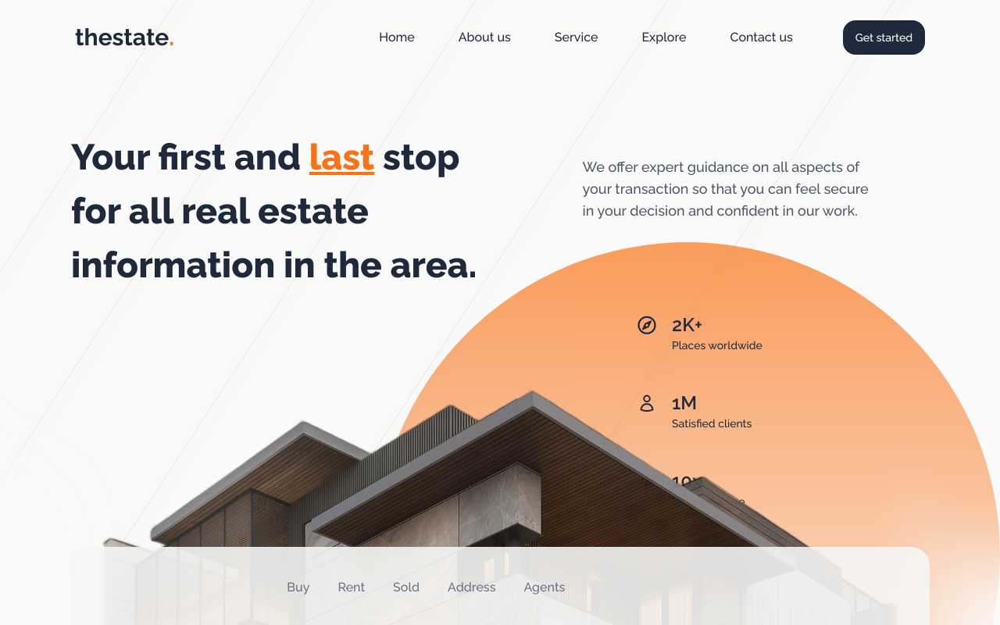

# The State - Real Estate Landing page
A modern and user-friendly landing page.

## Technologies Used
- NextJs
- Tailwindcss
- Framer Motion
- Swiperjs

## Features
- Clean and modern design
- smooth and clean animations with framer motion

## Installation and Setup
1. Clone the repository to your local machine: `git clone https://github.com/NacereddineRebouh/the-State.git`
2. Navigate to the project directory: `cd the-State`
3. Install the required packages: `npm install`
4. Start the development server: `npm run dev`

## Screenshots

## Demo
Demo here: https://the-state.vercel.app
"# real-state-landing-page-next-js" 
